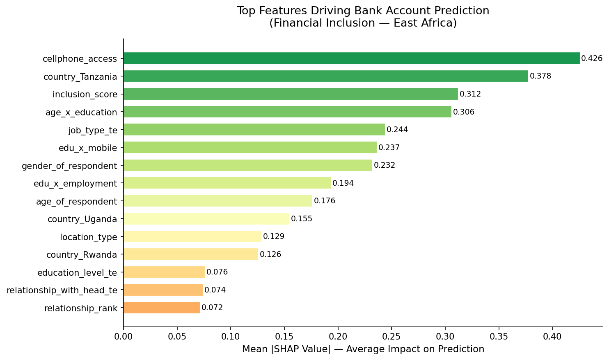

# 🌍 Financial Inclusion in Africa — Predictive ML + Policy Insights

<p align="center">
  
</p>

<p align="center">
  <b>Kelvin Byabato</b> | <a href="https://github.com/Byabato">Byabato</a> 
</p>

<p align="center">
  
  
  
  
  
  
</p>

---

## 📌 The Problem

Only **14% of adults** across Kenya, Rwanda, Tanzania, and Uganda have access to a commercial bank account. Financial exclusion traps families in poverty cycles, blocks access to credit, and prevents entire economies from growing.

This project builds a machine learning model to **predict** which individuals are most likely to be unbanked — and goes further to **explain why** and **recommend interventions** using SHAP-powered personalized pathways.

**Challenge:** [Zindi Africa — Financial Inclusion in Africa](https://zindi.africa/competitions/financial-inclusion-in-africa)  
**Metric:** Mean Absolute Error (MAE) | **Result: OOF MAE 0.1117 | AUC 0.8647**  
**Data:** ~33,600 survey respondents across 4 East African countries (2016–2018)

---

## 🏆 Results

| Model | OOF MAE | OOF AUC |
|---|---|---|
| Logistic Regression (baseline) | ~0.17 | ~0.75 |
| XGBoost | ~0.13 | ~0.84 |
| LightGBM | ~0.13 | ~0.84 |
| CatBoost | ~0.13 | ~0.84 |
| **Stacking Ensemble (final)** | **0.1117** | **0.8647** |

---

## 🔬 What Makes This Different

Most submissions output `0` or `1`. This project goes 3 layers deeper:

**Layer 1 — Predict:** Stacked ensemble of XGBoost + LightGBM + CatBoost, Optuna-tuned, threshold-optimized.

**Layer 2 — Explain:** SHAP TreeExplainer reveals *why* each person was predicted unbanked.

**Layer 3 — Act:** A Financial Inclusion Recommender maps each person's barriers to SDG-aligned interventions:

```
Person uniqueid_6065 x Kenya — Predicted: UNBANKED
  📱 Mobile money bridge       ← #1 barrier: no cellphone access (SHAP: -0.843)
     SDG 9: Industry, Innovation & Infrastructure
  📊 Multi-factor intervention ← #2 barrier: low inclusion score (SHAP: -0.617)
     SDG 1, 4, 8, 10
```

---

## 📊 SHAP Feature Importance

<p align="center">
  
</p>
<p align="center"><i>Notice how Cellphone Access has a higher SHAP value than Education; this suggests that infrastructure is a greater barrier to entry than literacy in these regions.</i></p>

Top drivers of financial exclusion (from SHAP analysis):

1. **Cellphone access** — No mobile = no banking pathway. The #1 actionable barrier.
2. **Country (Tanzania)** — Being in Tanzania is itself a significant structural barrier.
3. **Inclusion score** — Low composite of employment + education + mobile + urban = excluded.
4. **Age × Education** — Young AND uneducated = highest exclusion risk.
5. **Employment type** — Formal employment unlocks banking; no income locks it out.
6. **Gender** — Men consistently more banked, signalling structural gender barriers.

---

## 🌍 Country Policy Scorecard

| Country | Predicted Inclusion | Primary Barrier | Priority Intervention |
|---|---|---|---|
| 🇺🇬 Uganda | 32.1% | Infrastructure gap | Agent banking expansion |
| 🇹🇿 Tanzania | 33.4% | Cellphone access | Mobile money programs |
| 🇷🇼 Rwanda | 50.8% | Composite exclusion | Multi-factor programs |
| 🇰🇪 Kenya | 73.2% | Age-education gap | Youth financial literacy |

> Kenya leads because of M-Pesa. Its mobile infrastructure model should be replicated across the region.
>
> This scorecard demonstrates how ML can be translated into actionable government policy, moving from abstract predictions to localized infrastructure priorities.

---

## 🏗️ Architecture

```
financial_inclusion_africa_ml_zindi/
├── src/
│   ├── config.py          — All constants, paths, encoding maps
│   ├── features.py        — 20+ engineered features (pure functions)
│   ├── models.py          — K-Fold training, threshold optimization
│   ├── ensemble.py        — Stacking + blending
│   ├── explainability.py  — SHAP beeswarm, bar, dependence plots
│   └── recommender.py     — Innovation: recommender + scorecard + simulator
├── notebooks/
│   ├── 01_EDA.py                        — 10 targeted visualizations
│   ├── 02_feature_engineering.py        — Pipeline + K-Fold target encoding
│   ├── 03_modeling.py                   — 4 models + stacking → submission
│   ├── 04_hyperparameter_tuning.py      — Optuna Bayesian search
│   └── 05_explainability_innovation.py  — SHAP + Recommender + Policy
├── data/raw/              — Train.csv, Test.csv (from Zindi, not tracked by git)
├── data/processed/        — Auto-generated engineered features
├── models/                — Saved models (not tracked by git)
└── outputs/               — All charts + submission.csv
```

---

## ⚙️ Methodology

### Feature Engineering (20+ features)
| Category | Features | Rationale |
|---|---|---|
| Ordinal encoding | `education_rank`, `employment_rank` | Preserves hierarchy |
| Domain composites | `inclusion_score`, `is_dependent` | Domain knowledge |
| Interactions | `edu_x_employment`, `age_x_education` | Synergy effects |
| Target encoding | `job_type_te`, `education_level_te` | Group inclusion rates |

### Training Strategy
- **Stratified K-Fold (k=5)** — preserves class balance per fold
- **K-Fold Target Encoding** — prevents data leakage
- **Threshold Optimization** — MAE-minimizing threshold scan (0.05→0.95)
- **Optuna (50 trials each)** — Bayesian hyperparameter search
- **Stacking** — LR meta-learner on OOF probabilities

---

## 🚀 Quick Start

```bash
git clone https://github.com/Byabato/financial-inclusion-africa-ml-zindi.git
cd financial_inclusion_africa
pip install -r requirements.txt

# Add Train.csv + Test.csv to data/raw/

python notebooks/01_EDA.py
python notebooks/02_feature_engineering.py
python notebooks/03_modeling.py
python notebooks/04_hyperparameter_tuning.py
python notebooks/05_explainability_innovation.py

# Submit: outputs/submission_tuned.csv → Zindi
```

---

## 📚 References

- [FinAccess Kenya 2018](https://www.fsdkenya.org/publication/finaccess2019/) · [FinScope Rwanda 2016](https://www.minecofin.gov.rw/) · [FinScope Tanzania 2017](https://www.fsdt.or.tz/) · [FinScope Uganda 2018](https://www.bou.or.ug/)
- Lundberg & Lee (2017) — [SHAP: A Unified Approach to Explaining Model Predictions](https://arxiv.org/abs/1705.07874)
- World Bank Global Findex Database 2021

---

## ⚡ Lightning AI Studios
This project was developed and hosted entirely on Lightning AI Studios—a collaborative, persistent cloud workspace with on-demand GPU access (A100s, H100s). No Google Colab required. Lightning AI Studios provides a VS Code-like IDE experience in the cloud, ideal for reproducible, scalable machine learning workflows.

To run or reproduce:
- Clone the repo to your Lightning AI Studios workspace
- Install dependencies from requirements.txt
- Launch notebooks or scripts as needed
