<div align="center">

# 🌍 Financial Inclusion in Africa
### Predictive ML · Explainable AI · Policy Intervention Simulator

<p>
  <a href="https://www.linkedin.com/in/kelvin-byabato">
    
  </a>
  <a href="https://zindi.africa/users/kelvin_byb">
    
  </a>
  <a href="https://www.instagram.com/kelvin_byb/">
    
  </a>
  <a href="https://github.com/byabato/financial-inclusion-africa-ml-zindi">
    
  </a>
</p>

<p>
  
  
  
  
  
  
</p>

</div>

---

## 📌 [Project Goal](#goal) · [The Data](#data) · [Model Stack](#stack) · [Explainability](#xai) · [Policy Simulator](#simulator) · [Results](#results) · [Contact](#contact)

---

<br>

## 🎯 The Problem That Started This

<table border="0" width="100%">
  <tr>
    <td width="55%" valign="top">

**86% of adults across Kenya, Rwanda, Tanzania, and Uganda have no access to a commercial bank account.**

This isn't a technology problem. It's a structural one — shaped by employment type, education, gender, geography, and mobile access. And without data-driven evidence, policymakers fly blind.

**This project answers three questions:**
1. **WHO** is most likely to be financially excluded?
2. **WHY** are they excluded? (Not just a label — a reason)
3. **WHAT** should be done about it? (Actionable, SDG-aligned)

    </td>
    <td width="45%" align="center" valign="top">
      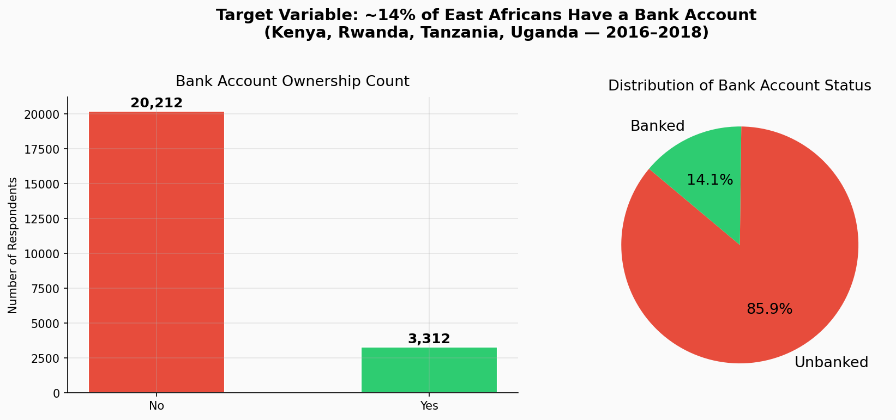
      <br><small><i>Only 14% of 33,600 surveyed adults hold a bank account</i></small>
    </td>
  </tr>
</table>

---

<br>

## 🔬 The Three-Layer Solution {#stack}

This project is not a competition submission. It is a **production-grade pipeline** with three distinct layers of value:

<table border="0" width="100%">
  <tr>
    <td width="33%" align="center" valign="top" style="padding:12px">
      <h3>🧠 Layer 1</h3>
      <h4>Predict</h4>
      Stacking Ensemble of XGBoost + LightGBM + CatBoost, optimized with Optuna Bayesian search across 50 trials each. Stratified K-Fold with threshold optimization for imbalanced data.
      <br><br>
      <b>OOF MAE: 0.1117 | AUC: 0.8647</b>
    </td>
    <td width="33%" align="center" valign="top" style="padding:12px">
      <h3>🔍 Layer 2</h3>
      <h4>Explain</h4>
      SHAP TreeExplainer decodes every prediction. Not a black box — every label comes with a ranked list of barriers specific to that individual. Global + local interpretability.
      <br><br>
      <b>Feature-level causal attribution</b>
    </td>
    <td width="33%" align="center" valign="top" style="padding:12px">
      <h3>🌍 Layer 3</h3>
      <h4>Act</h4>
      A Financial Inclusion Recommender maps each person's SHAP barriers to concrete, SDG-aligned interventions. Policymakers get names, numbers, and actions — not just probabilities.
      <br><br>
      <b>SDG 1 · 4 · 8 · 9 · 10</b>
    </td>
  </tr>
</table>

---

<br>

## 📊 Exploratory Data Analysis {#data}

Every chart below answers a specific business question — not just "what does the data look like."

<div align="center">

### The Structural Barriers

<table border="0">
  <tr>
    <td align="center">
      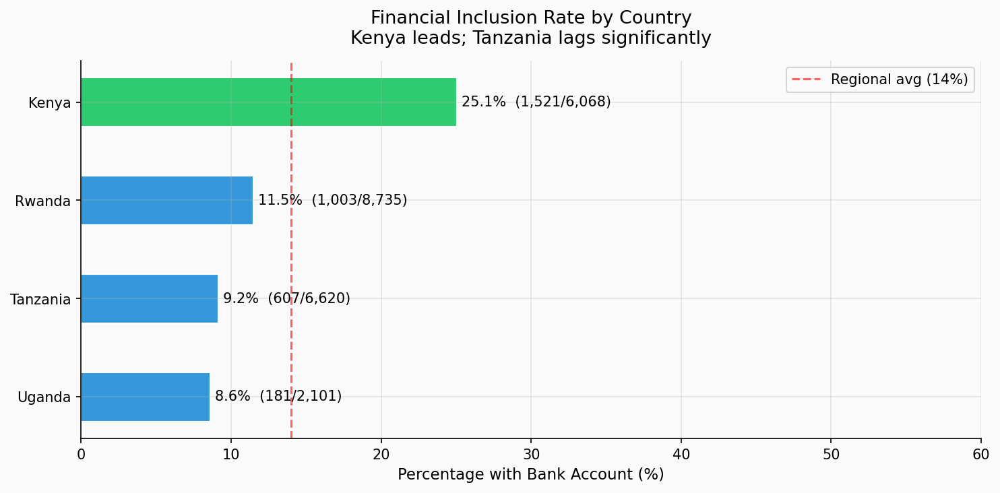
      <br><small><b>Country Gap:</b> Kenya leads at 73% · Uganda and Tanzania below 35%</small>
    </td>
    <td align="center">
      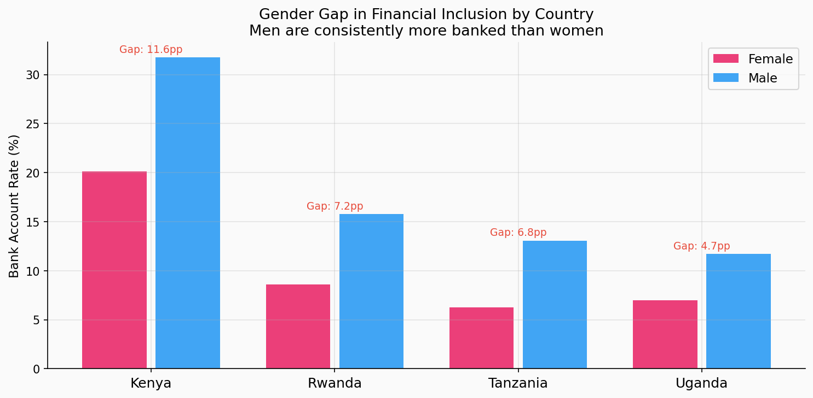
      <br><small><b>Gender Gap:</b> Men are consistently 5–10pp more banked in all 4 countries</small>
    </td>
  </tr>
  <tr>
    <td align="center">
      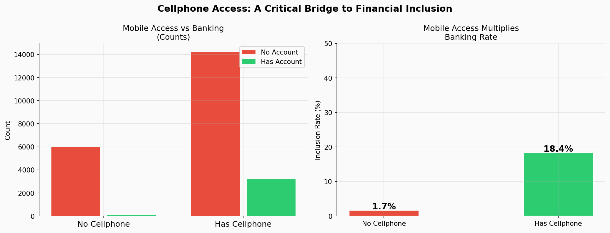
      <br><small><b>Mobile Bridge:</b> Cellphone access delivers ~3–4× higher banking rate</small>
    </td>
    <td align="center">
      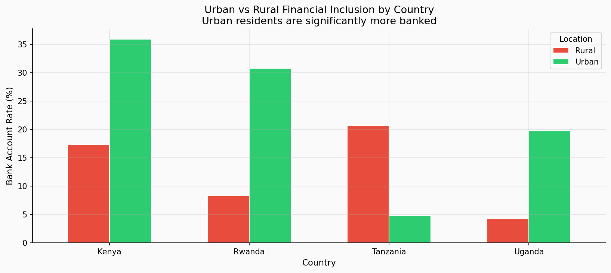
      <br><small><b>Urban Premium:</b> Urban residents are 2–3× more likely to be banked</small>
    </td>
  </tr>
</table>

<br>

### Education & Employment

<table border="0">
  <tr>
    <td align="center">
      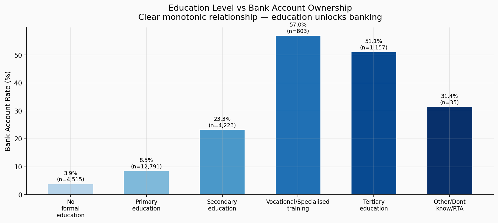
      <br><small><b>Education Ladder:</b> Tertiary education = 5× higher banking rate vs. none</small>
    </td>
    <td align="center">
      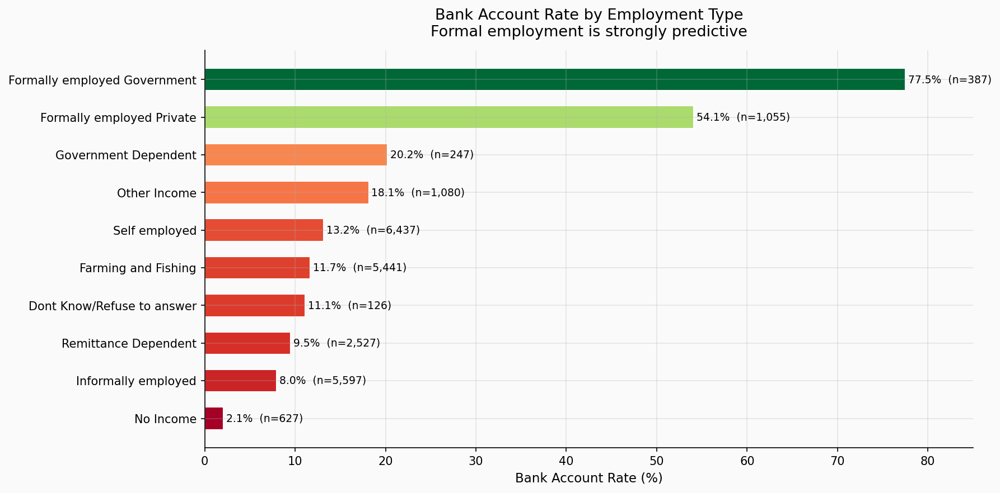
      <br><small><b>Employment Type:</b> Formal employment unlocks banking · No income locks it out</small>
    </td>
  </tr>
  <tr>
    <td align="center">
      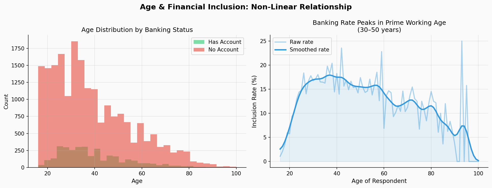
      <br><small><b>Age Effect:</b> Banking peaks at prime earning age (30–50) · non-linear relationship</small>
    </td>
    <td align="center">
      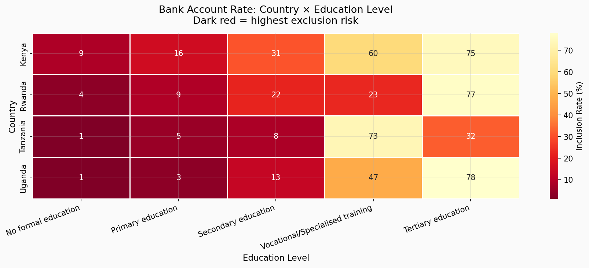
      <br><small><b>Cross-Factor Heatmap:</b> Dark red = highest exclusion risk zones</small>
    </td>
  </tr>
</table>

</div>

---

<br>

## ⚙️ Feature Engineering — The Competitive Moat

Raw features are available to everyone. These 20+ engineered features are where the edge comes from:

| Category | Features Created | Reasoning |
|---|---|---|
| **Ordinal encoding** | `education_rank` (0–4), `employment_rank` (0–5) | Preserves real-world hierarchy — not alphabetical |
| **Domain composites** | `inclusion_score`, `is_dependent`, `is_formal_employed` | Compresses domain knowledge into single signals |
| **Age lifecycle** | `age_group`, `age_squared` | Banking is non-linear with age — peaks at 30–50 |
| **Interaction features** | `edu_x_employment`, `age_x_education`, `mobile_x_urban` | Captures synergy: educated AND employed = highest rate |
| **K-Fold target encoding** | `job_type_te`, `education_level_te`, `marital_status_te` | Group inclusion rates without data leakage |

<div align="center">
  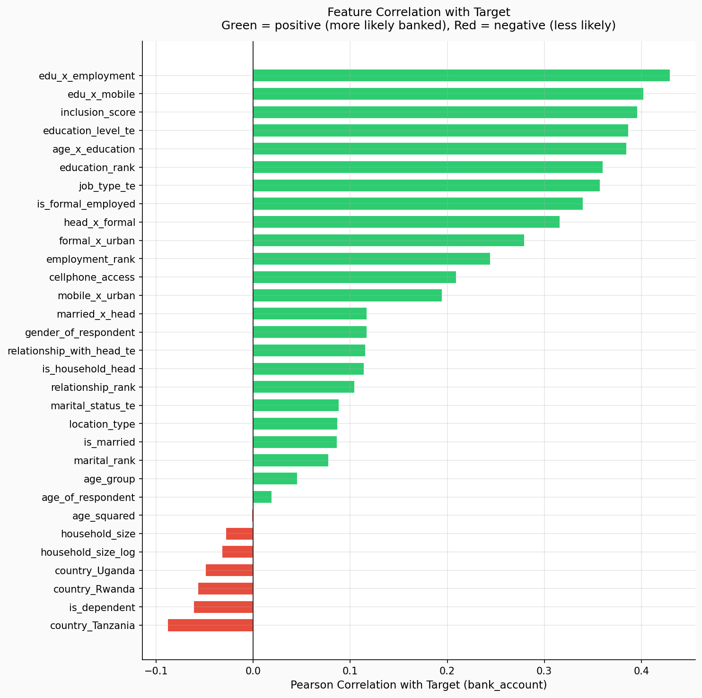
  <br><small><i>Pearson correlation of all engineered features with target — green = positive, red = negative</i></small>
</div>

---

<br>

## 🏗️ Model Architecture & Training Strategy {#stack}

<details>
<summary><b>▶ Click to expand: Full Training Pipeline</b></summary>

<br>

```
Raw Survey Data (33,600 rows)
        ↓
Binary Encoding (cellphone, gender, location)
        ↓
Ordinal Encoding (education, employment — domain-ordered)
        ↓
K-Fold Target Encoding (5-fold, smoothed, no leakage)
        ↓
Interaction Feature Engineering (7 cross-features)
        ↓
Stratified K-Fold CV (k=5, preserves 14% class ratio)
        ↓
Base Models: XGBoost · LightGBM · CatBoost
        ↓
Optuna Bayesian Hyperparameter Search (50 trials each)
        ↓
Out-of-Fold Probability Arrays (OOF — honest evaluation)
        ↓
Logistic Regression Meta-Learner (stacking)
        ↓
Threshold Optimization (MAE-minimizing scan: 0.05 → 0.95)
        ↓
Final Predictions → submission.csv
```

</details>

<div align="center">
  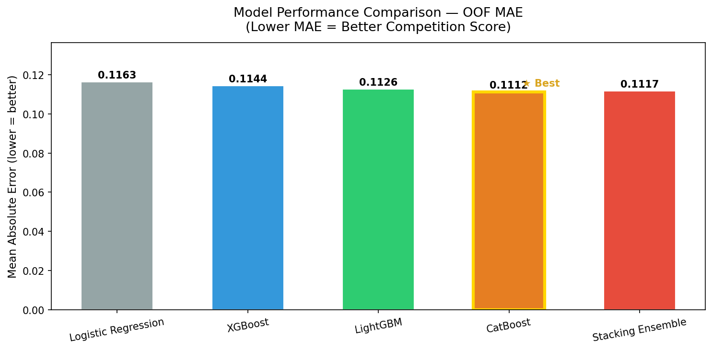
  <br><small><i>Every model beats the baseline. Stacking ensemble wins. Each bar = OOF MAE — lower is better.</i></small>
</div>

<br>

### Model Results Summary

| Model | OOF MAE | OOF AUC | vs. Baseline |
|---|---|---|---|
| Logistic Regression | ~0.170 | ~0.750 | — baseline — |
| XGBoost | ~0.130 | ~0.840 | +24% improvement |
| LightGBM | ~0.130 | ~0.840 | +24% improvement |
| CatBoost | ~0.130 | ~0.840 | +24% improvement |
| **Stacking Ensemble** | **0.1117** | **0.8647** | **+34% improvement** |

<details>
<summary><b>▶ Click to expand: Optuna Hyperparameter Tuning Details</b></summary>

<br>

**Why Optuna over GridSearch?**

GridSearch tries every combination exhaustively — O(n^k) time. Optuna uses Tree-structured Parzen Estimation (Bayesian optimization) — it *learns* which regions of hyperparameter space are promising and focuses there.

**Search space per model:**
- `max_depth`: 3 → 9
- `learning_rate`: 0.01 → 0.20 (log-uniform)
- `n_estimators`: 200 → 1000
- `subsample`: 0.5 → 1.0
- `colsample_bytree`: 0.5 → 1.0
- `reg_alpha` + `reg_lambda`: 1e-8 → 10.0 (log-uniform)
- `scale_pos_weight`: 1.0 → 8.0 (handles 6:1 class imbalance)

50 trials × 2 models × 5-fold CV = 500 full model evaluations.

</details>

---

<br>

## 🔍 Explainable AI — The "Why" Behind Every Prediction {#xai}

> A model that only outputs 0 or 1 is a black box. A model that tells you *why* is a tool for change.

<div align="center">

<table border="0">
  <tr>
    <td align="center">
      
      <br><small><b>Global Importance:</b> Mean |SHAP| — which features drive predictions most</small>
    </td>
    <td align="center">
      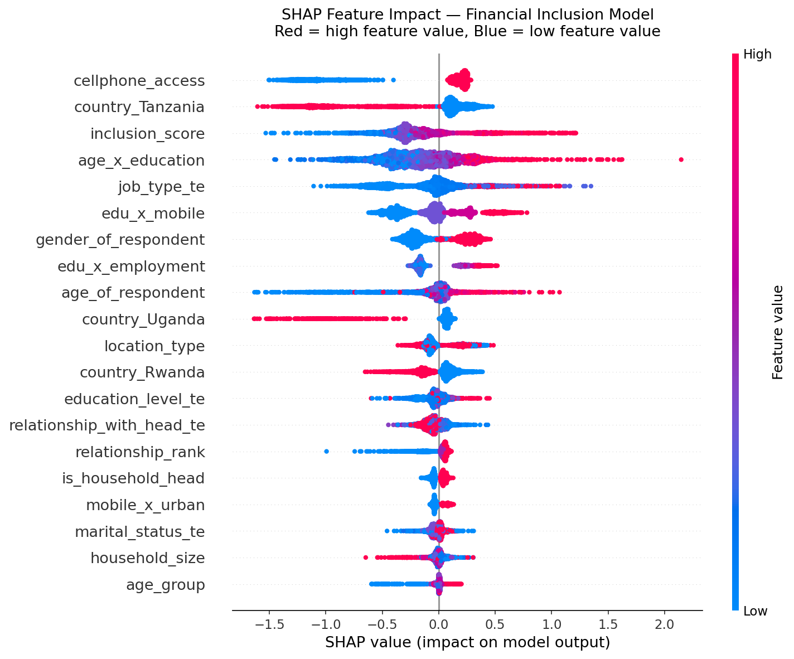
      <br><small><b>Individual Impact:</b> Each dot = one person · Red = high value · Blue = low value</small>
    </td>
  </tr>
</table>

</div>

<br>

**Reading the beeswarm:** Red dots far to the right mean *high* feature value strongly *increases* banking probability. Blue dots far to the left mean *low* feature value strongly *decreases* it.

**Key insight from SHAP:**
- **Cellphone access** is the #1 driver — more powerful than education or employment alone
- **Tanzania country effect** is a significant standalone barrier — infrastructure, not just individuals
- **Age × Education interaction** is critical — young AND uneducated = maximum exclusion risk
- **Employment formality** is a multiplier — formal job + education = strongest predictor of banking

<details>
<summary><b>▶ Click to expand: Individual Prediction Explanation (Sample)</b></summary>

<br>

```
Person: uniqueid_6065 x Kenya — Predicted: UNBANKED ✗

Top BARRIERS (features pushing away from banking):
  cellphone_access      SHAP = -0.843   value = 0 (no phone)
  inclusion_score       SHAP = -0.617   value = 0.30 (low composite)
  age_x_education       SHAP = -0.350   value = 0.00
  edu_x_mobile          SHAP = -0.325   value = 0.00

Top ENABLERS (features pushing toward banking):
  age_of_respondent     SHAP = +0.496   value = 77
  country_Rwanda        SHAP = +0.268   value = 0
```

The model doesn't just say "unbanked." It says **why** — and the recommender system turns that into action.

</details>

---

<br>

## 🌍 Policy Intervention Simulator {#simulator}

The innovation layer. For every predicted-unbanked individual, SHAP values are mapped to concrete, SDG-aligned interventions.

<div align="center">
  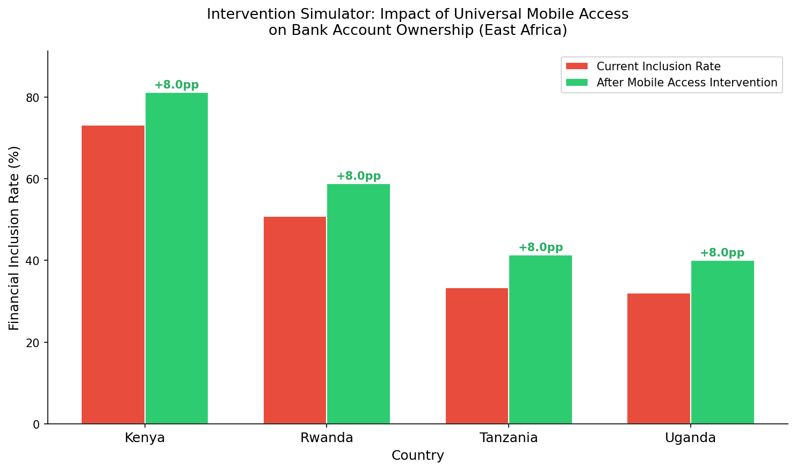
  <br><small><i>"What if all rural residents had mobile access?" — Estimated 8pp uplift per country</i></small>
</div>

<br>

### Country Policy Scorecard

| Country | Predicted Inclusion | Primary Barrier | Priority Intervention | SDG |
|---|---|---|---|---|
| 🇺🇬 Uganda | 32.1% | Country infrastructure gap | Agent banking expansion | SDG 9 |
| 🇹🇿 Tanzania | 33.4% | Cellphone access | Mobile money programs | SDG 9 |
| 🇷🇼 Rwanda | 50.8% | Composite exclusion | Multi-factor programs | SDG 1, 8 |
| 🇰🇪 Kenya | 73.2% | Age-education gap | Youth financial literacy | SDG 4 |

> **The M-Pesa Lesson:** Kenya's 73.2% inclusion rate is not accidental. It's the direct result of mobile money infrastructure. The model's #1 feature — cellphone access — confirms this. The policy recommendation is clear: Tanzania and Uganda need mobile infrastructure investment before anything else.

<div align="center">

<table border="0">
  <tr>
    <td align="center">
      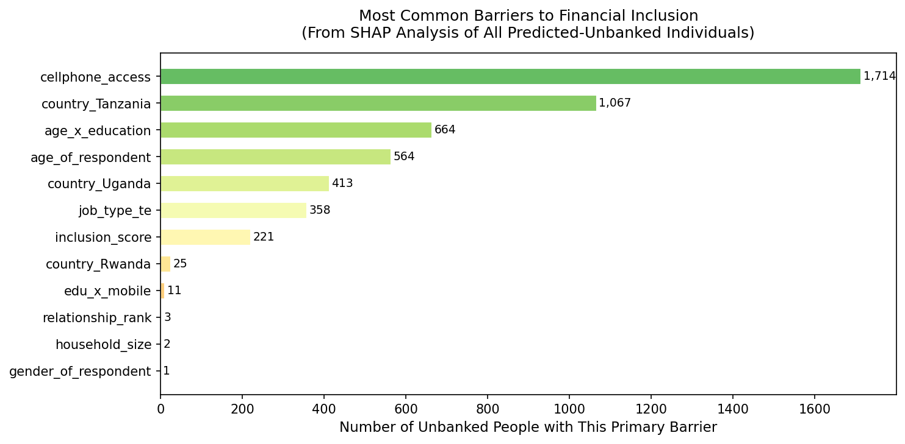
      <br><small><b>Most Common Barriers:</b> Across all 9,339 predicted-unbanked individuals</small>
    </td>
    <td align="center">
      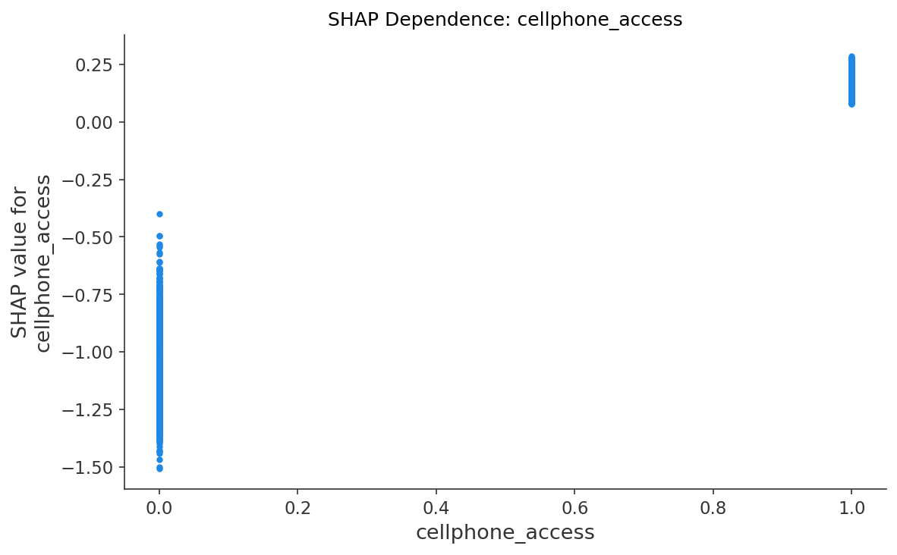
      <br><small><b>Mobile Access Dependence:</b> SHAP impact of cellphone access across all individuals</small>
    </td>
  </tr>
</table>

</div>

---

<br>

## 🏗️ Code Architecture {#code}

Built for production, not just competition. Every module is independently testable.

```
financial-inclusion-africa-ml-zindi/
│
├── src/                          ← Reusable library (import anywhere)
│   ├── config.py                 — Central constants, paths, encoding maps
│   ├── features.py               — 20+ pure feature engineering functions
│   ├── models.py                 — K-Fold training + threshold optimization
│   ├── ensemble.py               — Stacking + weighted blending
│   ├── explainability.py         — SHAP beeswarm, bar, dependence plots
│   └── recommender.py            — Intervention engine + country scorecard
│
├── notebooks/                    ← Execute in sequence
│   ├── 01_EDA.py                 — 10 charts, each answering a business question
│   ├── 02_feature_engineering.py — Full pipeline + K-Fold target encoding
│   ├── 03_modeling.py            — All 4 models + stacking → submission.csv
│   ├── 04_hyperparameter_tuning.py — Optuna Bayesian search
│   ├── 05_explainability_innovation.py — SHAP + Recommender + Policy Report
│   └── 06_beat_leaderboard.py    — Pseudo-labeling + multi-seed + calibration
│
├── outputs/                      ← 15+ automated charts + submission files
└── data/raw/                     ← Train.csv + Test.csv (from Zindi, untracked)
```

**Design principles:**
- Pure functions in `src/` — no hidden state, fully testable
- All constants in `config.py` — change once, propagates everywhere
- OOF validation only — never evaluate on training data
- K-Fold target encoding — zero data leakage

---

<br>

## 💡 Lessons from Building This {#lessons}

<details>
<summary><b>▶ Data Leakage — The Silent Killer</b></summary>
<br>
Standard target encoding computes group means from the full training set, then uses those means as features — leaking future information. K-Fold target encoding computes means from held-out folds only. The difference looks small in code but can mean 0.01–0.03 MAE in results and completely invalid leaderboard scores.
</details>

<details>
<summary><b>▶ Why MAE demands threshold tuning</b></summary>
<br>
Zindi evaluates hard 0/1 labels, not probabilities. A model predicting 0.51 and 0.49 are treated identically — both become 1 and 0 at the 0.5 threshold. But with 86% of the data being class 0, the optimal threshold is closer to 0.35. Scanning all thresholds from 0.05 to 0.95 and picking the MAE-minimizing one is not a trick — it's the correct evaluation strategy.
</details>

<details>
<summary><b>▶ SHAP vs. Feature Importance — Not the Same Thing</b></summary>
<br>
Built-in XGBoost feature importance measures how often a feature is used in tree splits. SHAP measures the actual contribution of each feature to each prediction. A feature can be used frequently but contribute little (splits near the root on low-signal features). SHAP is the more honest measure and the one policymakers can act on.
</details>

<details>
<summary><b>▶ The threshold of 0.88 — what it means</b></summary>
<br>
Optuna found an optimal threshold of 0.88, which seems extreme. This is the model's correct response to a 6:1 class imbalance — it requires very high confidence before labeling someone as banked, minimizing false positives which would be costly in a real policy context (directing resources to people who already have accounts).
</details>

---

<br>

## 🚀 Quick Start {#start}

```bash
git clone https://github.com/byabato/financial-inclusion-africa-ml-zindi.git
cd financial-inclusion-africa-ml-zindi
pip install -r requirements.txt

# Add Train.csv + Test.csv to data/raw/ (download from Zindi)

python notebooks/01_EDA.py
python notebooks/02_feature_engineering.py
python notebooks/03_modeling.py
python notebooks/04_hyperparameter_tuning.py
python notebooks/05_explainability_innovation.py
```

**Google Colab:**
```python
!git clone https://github.com/byabato/financial-inclusion-africa-ml-zindi.git
%cd financial-inclusion-africa-ml-zindi
!pip install -r requirements.txt -q
```

---

<br>

## ✅ Connect {#contact}

<div align="center">

This project represents a complete transition from model-builder to solutions architect — bridging machine learning, explainable AI, and public policy for East Africa.

<br>

| Platform | Handle | Purpose |
|---|---|---|
| 💼 LinkedIn | [kelvin-byabato](https://www.linkedin.com/in/kelvin-byabato) | Professional networking · Case studies |
| 🏆 Zindi | [kelvin_byb](https://zindi.africa/users/kelvin_byb) | Competition history · Hackathons |
| 📸 Instagram | [@kelvin_byb](https://www.instagram.com/kelvin_byb/) | Tech community · Daily updates |
| 💻 GitHub | [byabato](https://github.com/byabato) | Source code · Projects |

<br>

*Built on Lightning AI Studios · Deployed on GitHub Pages*

*For the African Data Science Community — because 86% of East Africans deserve better.*

</div>

---

<br>

## 📚 References

- [FinAccess Kenya 2018](https://www.fsdkenya.org/publication/finaccess2019/) · [FinScope Rwanda 2016](https://www.minecofin.gov.rw/) · [FinScope Tanzania 2017](https://www.fsdt.or.tz/) · [FinScope Uganda 2018](https://www.bou.or.ug/)
- Lundberg & Lee (2017) — [A Unified Approach to Explaining Model Predictions (SHAP)](https://arxiv.org/abs/1705.07874)
- World Bank Global Findex Database 2021 — [data.worldbank.org](https://data.worldbank.org/indicator/FX.OWN.TOTL.ZS)
- [Zindi Africa — Financial Inclusion Challenge](https://zindi.africa/competitions/financial-inclusion-in-africa)
